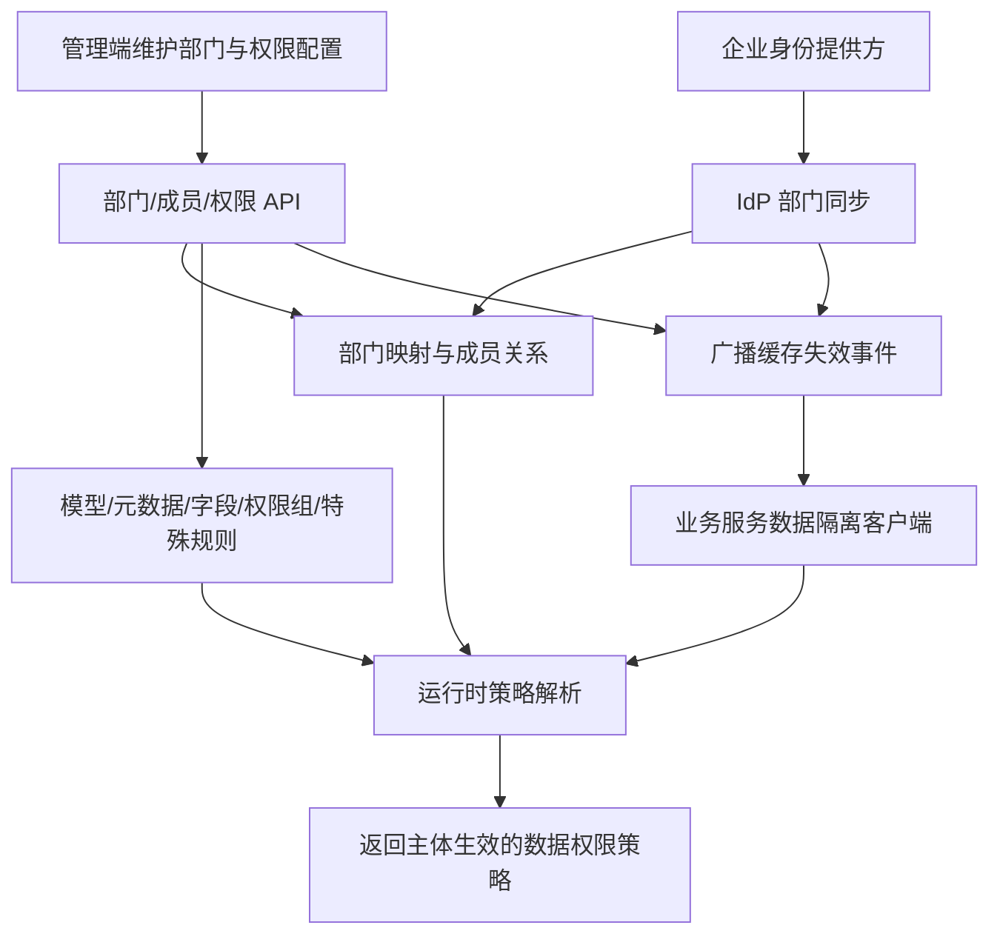

  

# g2rain-department

下一代AI软件开发范式，AI原生Agent平台，开源的企业级SaaS底座。

部门与数据权限后端服务，围绕部门树、成员归属、身份提供方同步、数据权限模型、字段、策略与权限组提供统一领域能力；为管理端、主体增强组件和业务服务的数据隔离链路提供控制面能力

[官网](https://www.g2rain.com) · [Issues](https://github.com/g2rain/g2rain/issues) · [Discussions](https://github.com/g2rain/g2rain/discussions)

## 目录

- 项目简介
- 项目文档
- 平台定位
- 业务域说明
- 功能概览
- 使用场景
- 核心流程
- 流程图
- 技术栈
- 环境要求
- 快速开始
- 构建与镜像
- 接口示例
- 安全说明
- 与关联仓库的关系
- 模块说明
- 职责边界
- 主要 HTTP 路径
- 常见问题
- 关联仓库
- 参与贡献
- 许可证
- 联系我们
- 致谢

## 项目简介

部门与数据权限后端服务，围绕部门树、成员归属、身份提供方同步、数据权限模型、字段、策略与权限组提供统一领域能力；为管理端、主体增强组件和业务服务的数据隔离链路提供控制面能力

## 项目文档

完整的架构、开发、安全、配置、部署和需求说明见 [`docs/index.md`](docs/index.md)。项目当前计划接入中央 `java-domain-service 1.0.0`，尚待处理的基线差异见 [`docs/architecture/deviations.md`](docs/architecture/deviations.md)。

## 平台定位

该仓库位于 g2rain 平台的组织治理与数据权限控制面：向管理端提供部门树、成员归属和身份提供方同步能力，向 Starter 与业务服务提供部门主体增强及运行时数据权限策略。它负责维护权限元数据与发布缓存失效信号，但不直接执行下游业务 SQL 的数据隔离。

## 业务域说明

该仓库聚焦于 `组织部门、成员归属、数据权限模型与权限策略治理`。

核心对象包括：
- 部门
- 部门成员关系
- 部门树
- 权限
- 权限组成员关系
- 身份提供方部门映射
- 数据权限模型
- 数据权限元数据
- 数据权限组
- 特殊权限规则
- 条件字段
- 应用
- 用户
- 运行时权限策略

主要流程包括：
- 部门创建、层级调整、树形组装与状态维护流程
- 部门成员或权限组成员的批量分配与关系维护流程
- 身份提供方部门映射、父子排序、增量/全量成员对账流程
- 数据权限模型、元数据、条件字段与特殊规则配置流程
- 运行时策略解析与缓存失效同步流程

## 功能概览

| 能力 | 说明 |
| --- | --- |
| 部门树管理 | 维护部门层级、组织路径和部门基础信息。 |
| 部门成员关系 | 维护用户与部门之间的归属关系及身份同步。 |
| 身份提供方部门同步 | 将外部 IdP 部门树映射到平台部门，按父子顺序写入，并支持增量或全量成员对账。 |
| 数据权限建模 | 定义业务表的数据权限模型、条件字段和策略元数据。 |
| 权限分组与策略 | 维护权限组、成员关系、特殊规则及运行时权限策略。 |
| 运行时策略解析 | 根据应用、业务表和当前主体聚合权限元数据，向数据隔离客户端返回生效策略。 |
| 权限变更同步 | 在权限数据变化后广播缓存失效与策略刷新事件。 |

## 使用场景

| 场景 | 说明 |
| --- | --- |
| 维护组织部门树 | 管理人员需要按机构维护多级部门、负责人和启停状态，并为页面或内部客户端提供树形结构时使用。 |
| 批量分配部门成员 | 需要把用户批量加入部门或权限组，并为主体上下文补充部门归属信息时使用。 |
| 同步企业身份目录 | 需要将身份提供方的部门和成员同步到平台，或通过全量模式清理已失效关系时使用。 |
| 配置数据权限模型 | 业务表需要声明隔离模型、条件字段和策略元数据，供运行时数据访问组件消费时使用。 |
| 维护权限组与特殊规则 | 需要按用户分组授权，或对特定主体设置区别于默认规则的数据范围时使用。 |
| 解析运行时权限策略 | 业务服务准备执行隔离查询前，需要根据应用、数据表和当前主体获取最终策略时使用。 |

## 核心流程

| 流程 | 关键步骤 | 代码线索 |
| --- | --- | --- |
| 部门树维护 | 查询部门列表或树 → 校验机构边界与父部门关系 → 新增或更新部门及负责人 → 更新启停状态或删除节点 → 广播部门与策略缓存失效事件 | DepartmentController、DepartmentService、DepartmentTreeVo、DataPermissionPolicyCacheBroadcaster |
| 部门与权限组成员分配 | 提交用户标识集合 → 校验部门或权限组 → 批量新增成员关系 → 更新关系状态或移除成员 → 主体增强或策略解析读取最新关系 | DepartmentUserRelationController、DataPermissionGroupUserRelationController、DepartmentAssignUsersDto、GroupAssignUsersDto |
| 身份提供方部门同步 | 校验当前主体是管理员且机构匹配 → 按父部门优先顺序整理 IdP 部门 → 新增或更新平台部门并保存 IdP 映射 → 按增量或全量模式同步成员 → 全量对账时按安全开关移除失效关系 → 返回同步结果与映射标识 | DepartmentIdpSyncController、DepartmentIdpSyncService、DepartmentIdpSyncDto、DepartmentIdpSyncResultVo |
| 数据权限配置 | 定义数据权限模型 → 登记应用与业务表元数据 → 配置可参与过滤的条件字段 → 建立权限组并分配用户 → 补充特殊权限规则 → 发布策略缓存失效事件 | DataPermissionModelController、DataPermissionMetaController、DataPermissionFieldController、DataPermissionGroupController、DataPermissionOtherController |
| 运行时策略解析 | 客户端提交应用、业务表和主体信息 → 加载匹配的数据权限元数据 → 聚合部门、权限组与特殊规则 → 解析字段条件和最终数据范围 → 返回运行时权限策略 → 配置变更后由同步事件使缓存失效 | GET /data_permission_meta/policy_resolve、DataPermissionPolicyResolveDto、DataPermissionPolicyVo、DataPermissionMetaService |

## 流程图

## 技术栈

| 类别 | 说明 |
| --- | --- |
| 运行时 | Java 25、Spring Boot 4.0.5、Spring Cloud 2025.1.1 |
| 安全与令牌 | g2rain-starter-aegis-core |
| 基础设施 | Redis、Nacos |
| 其他 | Lombok |

## 环境要求

- JDK 25+
- Maven 3.9+
- Redis
- Nacos
- 可访问的 g2rain-basis 服务

## 快速开始

| 步骤 | 命令或位置 | 说明 |
| --- | --- | --- |
| 准备运行环境 | JDK 25+、Maven 3.9+、Redis、Nacos | 后端服务启动前需要准备 Java 构建环境和平台依赖的基础设施。 |
| 调整配置 | `src/main/resources/application.yml` | 按需设置 SERVER_PORT、SPRING_PROFILES_ACTIVE、NACOS_SERVER_ADDR 等环境变量。 |
| 构建项目 | `mvn clean package` | 执行 Maven 构建并生成可执行 Jar。 |
| 本地启动 | `mvn spring-boot:run` | 以当前 profile 启动服务，默认端口以 application.yml 中的 SERVER_PORT 为准。 |

版本号以项目构建配置为准，当前识别为 `1.0.0`。

## 构建与镜像

| 目标 | 命令 | 产物 | 说明 |
| --- | --- | --- | --- |
| 可执行 Jar | `mvn clean package` | `g2rain-department-1.0.0.jar` | 执行 Maven 标准构建，生成服务可执行产物。 |
| 本地运行 | `mvn spring-boot:run` | 本地 Spring Boot 进程 | 使用当前 profile 启动服务，便于本地联调。 |
| 构建脚本 | `./build.sh` | 脚本定义的构建结果 | 仓库提供 build.sh，可承载组织内约定的镜像或发布流程。 |

## 接口示例

| 示例 | 方法 | 路径 | 用途 | 调用示例 |
| --- | --- | --- | --- | --- |
| 查询部门树 | GET | `/department/tree` | 获取当前机构下可用于管理页面或主体增强的部门树。 | `curl http://localhost:8080/department/tree` |
| 保存部门 | POST | `/department/save` | 新增或更新部门基础信息和层级关系。 | `curl -X POST http://localhost:8080/department/save -H 'Content-Type: application/json' -d '{...}'` |
| 批量分配部门成员 | POST | `/department_user_relation/add_users` | 将一组用户批量加入指定部门。 | `curl -X POST http://localhost:8080/department_user_relation/add_users -H 'Content-Type: application/json' -d '{...}'` |
| 同步 IdP 部门 | POST | `/department_idp_sync/sync` | 按增量或全量模式同步身份提供方部门和成员关系。 | `curl -X POST http://localhost:8080/department_idp_sync/sync -H 'Content-Type: application/json' -d '{...}'` |
| 解析数据权限策略 | GET | `/data_permission_meta/policy_resolve` | 根据应用、业务表和主体信息返回运行时生效的数据权限策略。 | `curl 'http://localhost:8080/data_permission_meta/policy_resolve?applicationName=demo&tableName=sample'` |
| 批量分配权限组成员 | POST | `/data_permission_group_user_relation/add_users` | 将用户批量加入数据权限组，使分组规则参与策略解析。 | `curl -X POST http://localhost:8080/data_permission_group_user_relation/add_users -H 'Content-Type: application/json' -d '{...}'` |

## 安全说明

| 主题 | 说明 |
| --- | --- |
| IdP 同步授权 | 同步入口会校验当前主体的管理员身份及机构归属；部署时还应确保内部端点只通过可信网关或服务网络访问。 |
| 全量对账保护 | 全量成员同步可能移除已不存在的关系，应显式区分增量与全量模式，并保留安全开关、审计记录和回滚依据。 |
| 机构与租户边界 | 部门、成员、权限组和策略查询必须始终限定在当前机构或租户范围，避免跨组织读取与写入。 |
| 策略配置最小权限 | 数据权限模型、字段、权限组和特殊规则属于高敏配置，写操作应仅授予平台管理员或专门的数据治理角色。 |
| 内部策略接口 | policy_resolve 面向可信的数据隔离客户端，应校验服务身份与主体上下文，避免外部调用方枚举权限规则。 |
| 缓存一致性 | 部门负责人或权限配置变化后必须成功发布失效事件；消费者还应设置过期与兜底策略，避免长期使用旧权限。 |

## 与关联仓库的关系

本仓库从 g2rain-basis 获取用户与机构等平台主数据，由 g2rain-department-app 提供管理界面，并向 g2rain-spring-boot-starter 的部门主体增强与数据隔离模块提供部门和权限策略接口；配置变化通过缓存同步链路通知业务服务刷新本地策略。

## 模块说明

| 模块 | 职责说明 | 代码线索 |
| --- | --- | --- |
| g2rain-department-api | 定义部门和数据权限领域 API 契约。 | g2rain-department-api |
| g2rain-department-biz | 实现部门、成员关系与数据权限策略业务。 | g2rain-department-biz |
| g2rain-department-startup | 提供 Spring Boot 启动入口与运行配置。 | g2rain-department-startup |

## 职责边界

该仓库主要负责：
- 负责部门层级、部门成员关系及身份提供方部门映射的生命周期管理
- 负责数据权限模型、元数据、条件字段、权限组、特殊规则及运行时策略解析
- 负责在部门负责人或权限配置变化后广播缓存失效事件，保持多实例策略一致

该仓库默认不负责：
- 不作为用户、机构或身份提供方主数据的权威来源，这些数据由基础平台服务提供
- 不负责认证、令牌签发、网关入口校验或浏览器侧管理界面
- 不直接改写业务 SQL；运行时数据隔离由接入数据权限 Starter 的业务服务执行

## 主要 HTTP 路径

| 方法 | 路径 | 说明 |
| --- | --- | --- |
| GET | /department/list | 按列表或分页方式查询部门 |
| GET | /department/page | 按列表或分页方式查询部门 |
| GET | /department/tree | 查询当前机构的部门树 |
| POST | /department/save | 新增或更新部门及层级信息 |
| DELETE | /department/{id} | 删除指定部门 |
| POST | /department/{id}/status | 更新指定部门的启停状态 |
| GET | /department_user_relation/list | 按列表或分页方式查询对应领域数据 |
| GET | /department_user_relation/page | 按列表或分页方式查询对应领域数据 |
| GET | /department_user_relation/principal_enrichment | 查询主体的部门归属增强信息 |
| POST | /department_user_relation/save | 新增或更新对应领域数据 |
| POST | /department_user_relation/add_users | 向目标部门或权限组批量添加用户 |
| DELETE | /department_user_relation/{id} | 删除指定的对应领域数据 |
| POST | /department_idp_sync/sync | 执行身份提供方部门与成员同步 |
| GET | /department_idp_sync/mapped_idp_dept_ids | 查询已映射的身份提供方部门标识 |
| GET | /data_permission_model/list | 按列表或分页方式查询对应领域数据 |
| GET | /data_permission_model/page | 按列表或分页方式查询对应领域数据 |
| POST | /data_permission_model/save | 新增或更新对应领域数据 |
| DELETE | /data_permission_model/{id} | 删除指定的对应领域数据 |
| GET | /data_permission_meta/list | 按列表或分页方式查询对应领域数据 |
| GET | /data_permission_meta/page | 按列表或分页方式查询对应领域数据 |
| GET | /data_permission_meta/policy_resolve | 解析当前主体对指定业务表的生效策略 |
| POST | /data_permission_meta/save | 新增或更新对应领域数据 |
| DELETE | /data_permission_meta/{id} | 删除指定的对应领域数据 |
| POST | /data_permission_meta/{id}/status | 更新指定记录的启停状态 |
| GET | /data_permission_field/list | 按列表或分页方式查询对应领域数据 |
| GET | /data_permission_field/page | 按列表或分页方式查询对应领域数据 |
| POST | /data_permission_field/save | 新增或更新对应领域数据 |
| DELETE | /data_permission_field/{id} | 删除指定的对应领域数据 |
| GET | /data_permission_group/list | 按列表或分页方式查询对应领域数据 |
| GET | /data_permission_group/page | 按列表或分页方式查询对应领域数据 |
| POST | /data_permission_group/save | 新增或更新对应领域数据 |
| DELETE | /data_permission_group/{id} | 删除指定的对应领域数据 |
| POST | /data_permission_group/{id}/status | 更新指定记录的启停状态 |
| GET | /data_permission_group_user_relation/list | 按列表或分页方式查询对应领域数据 |
| GET | /data_permission_group_user_relation/page | 按列表或分页方式查询对应领域数据 |
| POST | /data_permission_group_user_relation/save | 新增或更新对应领域数据 |
| POST | /data_permission_group_user_relation/add_users | 向目标部门或权限组批量添加用户 |
| DELETE | /data_permission_group_user_relation/{id} | 删除指定的对应领域数据 |
| POST | /data_permission_group_user_relation/{id}/status | 更新指定记录的启停状态 |
| GET | /data_permission_other/list | 按列表或分页方式查询对应领域数据 |
| GET | /data_permission_other/page | 按列表或分页方式查询对应领域数据 |
| POST | /data_permission_other/save | 新增或更新对应领域数据 |
| DELETE | /data_permission_other/{id} | 删除指定的对应领域数据 |
| POST | /data_permission_other/{id}/status | 更新指定记录的启停状态 |

## 常见问题

| 问题 | 可能原因 | 处理建议 |
| --- | --- | --- |
| 部门树缺少节点或层级异常 | 父部门标识无效、机构边界不一致，或历史数据存在孤儿节点。 | 检查 Department 的 parentId、organId 和状态，确认父节点先于子节点存在，并核对树查询日志。 |
| 批量添加成员失败 | 部门/权限组不存在、用户标识为空或重复，或请求主体无当前机构权限。 | 核对 add_users 请求、目标对象状态、用户标识集合及网关透传的主体上下文。 |
| IdP 同步被拒绝 | 当前主体不是管理员，或同步参数中的机构与主体机构不匹配。 | 检查管理员权限、PrincipalContext 和 DepartmentIdpSyncDto 中的机构标识。 |
| 全量同步后旧成员仍存在 | 请求实际使用了增量模式，或未开启允许清理失效关系的安全选项。 | 确认 full/reconcile 类参数与服务日志；执行清理前先核对同步范围和预期差异。 |
| 运行时策略解析结果不符合预期 | 应用名、表名、主体部门、权限组、字段元数据或特殊规则之间不匹配。 | 从 policy_resolve 请求开始逐项核对模型、元数据、字段、成员关系和特殊规则，并检查返回策略。 |
| 权限修改后业务查询仍使用旧策略 | 缓存失效事件未发布、消息通道未消费，或客户端缓存尚未过期。 | 检查缓存失效广播器、Spring Cloud Stream 绑定、消费者日志及客户端缓存 TTL。 |
| 服务无法注册或读取配置 | Nacos、数据库或消息通道配置不正确。 | 检查启动模块 application.yml、Nacos 地址与命名空间、数据源和缓存同步绑定配置。 |

## 关联仓库

| 仓库 | 协作关系 |
| --- | --- |
| g2rain-basis | 协同提供用户、应用、通行证等平台基础主数据能力。 |
| g2rain-common | 复用平台公共规范、通用模型、工具能力或基础依赖约束。 |
| g2rain-iam | 协同完成登录认证、令牌发放、SSO 回调或前端登录态衔接。 |
| g2rain-infra | 协同提供路由、配置、基础设施数据或平台运行支撑能力。 |

## 参与贡献

我们欢迎所有形式的贡献：Issue 反馈、文档改进、功能建议与代码提交。

推荐流程：

1. Fork 本仓库。
2. 创建特性分支：`git checkout -b feature/your-feature-name`。
3. 提交更改：`git commit -m "Add some feature"`。
4. 推送分支：`git push origin feature/your-feature-name`。
5. 提交 Pull Request。

代码贡献前请尽量补充必要的测试和文档，并确保构建、测试与静态检查通过。

## 许可证

本项目基于 [Apache 2.0许可证](https://github.com/g2rain/g2rain-department/blob/main/LICENSE) 开源。

## 联系我们

- Issues: [GitHub Issues](https://github.com/g2rain/g2rain/issues)
- 讨论: [GitHub Discussions](https://github.com/g2rain/g2rain/discussions)
- 邮箱: g2rain_developer@163.com

## 致谢

感谢所有为 g2rain 项目提交 Issue、代码、文档、建议和使用反馈的开发者们！
