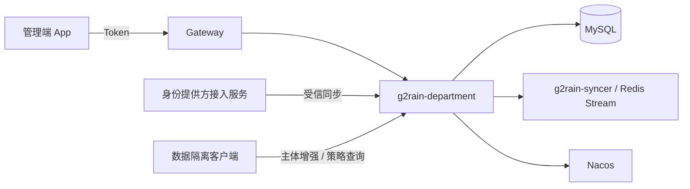

# 架构总览

本项目计划采用 g2rain `java-domain-service 1.0.0`。模块结构已经符合基线，但同步写契约、数据库唯一键和运行配置仍有待处理差异，详见[架构差异](deviations.md)。

## 系统职责

`g2rain-department` 是部门与数据权限控制面的数据所有者：

1. 维护部门层级、负责人、状态和用户归属。
2. 将 IdP 部门树和成员关系映射到平台部门。
3. 维护数据权限模型、字段、租户元数据、权限组和特殊规则。
4. 为受信的数据隔离客户端解析最终策略，并在配置变化后广播缓存失效事件。

## 非职责

- 不维护用户、机构、应用和 Passport 主数据。
- 不签发 Token，不承担登录、授权或网关鉴权。
- 不直接改写下游业务 SQL；业务服务中的数据隔离组件消费本服务策略。
- 不负责第三方回调验签、解密和原始组织通讯录拉取。
